<div align="center">


<br/>

[](https://www.typescriptlang.org/)
[](https://developer.visa.com)
[](./test-sdk.ts)
[](./LICENSE)
[](./src/client.ts)

</div>

---

## What is this?

Government procurement is slow, opaque, and expensive. This SDK wires the full Visa B2B payment infrastructure into a single TypeScript package — letting agencies go from **discovering a supplier** to **settling a payment** in one coherent flow, with AI-powered scoring and real-time payment controls at every step.

<div align="center">

```
  🏛️ Agency                                              Visa Network
  ────────────────────────────────────────────────────────────────────
  Discover suppliers ──▶ AI score + Visa verification
         │
         ▼
  Issue virtual card ──▶ Embedded spending rules (SPV · MCC · CHN · BHR)
         │
         ▼
  IPC Gen-AI controls ──▶ Natural language → rule set in one call
         │
         ▼
  BIP / SIP payment ──▶ Buyer or supplier initiated flows
         │
         ▼
  Settle on Visa rails ──▶ USD · Card  |  streaming state for UI
```

</div>

---

## Architecture

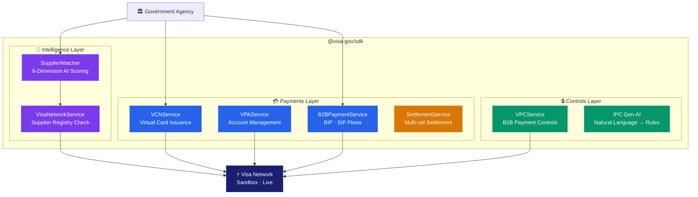

---

## Installation

```bash
npm install git+https://github.com/ericomack1983/visa-gov-sdk.git
```

```ts
import {
  VCNService,
  VPAService,
  B2BPaymentService,
  VisaNetworkService,
  SupplierMatcher,
  VPCService,
  SettlementService,
} from '@visa-gov/sdk';
```

Run everything with the unified test runner:

```bash
node run-tests.js           # all 8 suites
node run-tests.js --list    # show available suite keys
node run-tests.js --help    # full usage reference
```

---

## Feature Guide

| # | Feature | What it does | Real API |
|:-:|---------|-------------|:-------:|
| [1](#1--b2b-virtual-account-payments) | **B2B Virtual Account Payments** | Issue virtual cards with embedded spending rules | `POST /vpa/v1/cards/provisioning` |
| [2](#2--full-vpa-account-management) | **Full VPA Account Management** | Buyers, funding accounts, proxy pools, suppliers, payments | `/vpa/v1/*` |
| [3](#3--bip--sip-payment-flows) | **BIP & SIP Payment Flows** | Buyer-initiated and supplier-initiated B2B flows | `POST /vpa/v1/paymentService/*` |
| [4](#4--visa-supplier-match-service-sms) | **Visa Supplier Match Service** | Verify suppliers on the Visa network, get confidence score | `POST /visasuppliermatchingservice/v1/search` |
| [5](#5--ai-supplier-evaluation) | **AI Supplier Evaluation** | Score & rank bids across 6 weighted dimensions | SDK-internal |
| [6](#6--visa-b2b-payment-controls-vpc) | **Visa B2B Payment Controls** | Real-time spending rules on every virtual card | `/vpc/v1/*` |
| [7](#7--ipc--intelligent-payment-controls-gen-ai) | **IPC — Gen-AI Rules** | Natural language → payment control rules | `POST /vpc/v1/ipc/suggest` |
| [8](#8--settlement) | **Settlement** | Multi-rail payment settlement with streaming | SDK-internal |

---

## Testing

<div align="center">

https://raw.githubusercontent.com/ericomack1983/visa-gov-sdk/main/demo.mp4

</div>

### Unified runner

```
node run-tests.js [suite...] [--list] [--help]
```

| Key | Suite | Real endpoints |
|-----|-------|----------------|
| `vcn` | B2B Virtual Account Payments | `POST /vpa/v1/cards/provisioning` |
| `vpa` | Full VPA Account Management | `/vpa/v1/buyerManagement/*`, `/vpa/v1/accountManagement/*` |
| `bip` / `sip` | BIP & SIP Payment Flows | `POST /vpa/v1/paymentService/processPayments` |
| `sms` | Visa Supplier Match Service | `POST /visasuppliermatchingservice/v1/search` |
| `ai` | AI Supplier Evaluation | SDK-internal |
| `vpc` | Visa B2B Payment Controls | `/vpc/v1/*` |
| `ipc` | IPC — Gen-AI Rules | `POST /vpc/v1/ipc/suggest`, `POST /vpc/v1/ipc/apply` |
| `settlement` | Settlement | SDK-internal |

**Output legend:**

| Colour | Label | Meaning |
|--------|-------|---------|
| Green | `LIVE` | Real Visa sandbox returned 2xx — raw JSON shown |
| Yellow | `WARN` | Reached endpoint; business validation error (400/422) |
| Purple | `MOCK` | Endpoint requires additional provisioning |

---

## 1 · B2B Virtual Account Payments

> Issue a virtual card number (PAN) that only works for a specific supplier, amount range, time window, and merchant category — and expires automatically.

### How it works

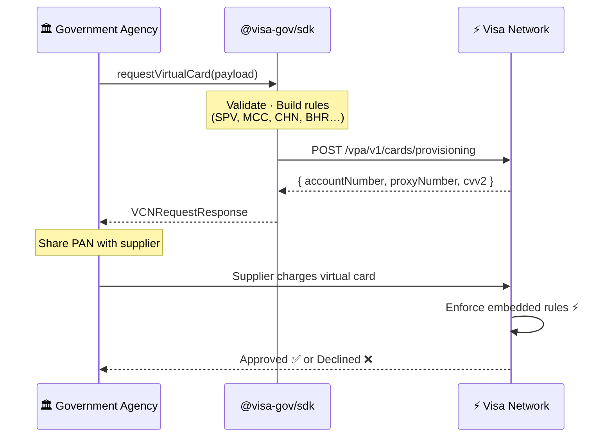

### Code

```ts
import { VCNService, buildSPVRule, buildBlockRule, buildAmountRule } from '@visa-gov/sdk';

const vcn = new VCNService();  // sandbox — no credentials needed

const response = await vcn.requestVirtualCard({
  clientId:      'B2BWS_1_1_9999',
  buyerId:       '9999',
  messageId:     Date.now().toString(),
  action:        'A',
  numberOfCards: '1',
  proxyPoolId:   'Proxy12345',
  requisitionDetails: {
    startDate: '2025-06-01',
    endDate:   '2025-06-30',
    timeZone:  'UTC-5',
    rules: [
      buildSPVRule({ spendLimitAmount: 50_000, maxAuth: 5, currencyCode: '840', rangeType: 'monthly' }),
      buildAmountRule('PUR', 10_000, '840'),   // max $10k per transaction
      buildBlockRule('ECOM'),                   // no online purchases
      buildBlockRule('ATM'),                    // no cash withdrawals
    ],
  },
});

console.log(response.responseCode);              // "00" = success
console.log(response.accounts[0].accountNumber); // Virtual card PAN
console.log(response.accounts[0].expiryDate);    // MM/YYYY
console.log(response.accounts[0].proxyNumber);   // Proxy reference
```

**Connect to the live Visa API:**

```ts
const response = await vcn.requestVirtualCard(payload, {
  baseUrl:     'https://sandbox.api.visa.com',
  credentials: { userId: process.env.VISA_USER_ID!, password: process.env.VISA_PASSWORD! },
  tls: {
    cert: fs.readFileSync('./certs/cert.pem', 'utf-8'),
    key:  fs.readFileSync('./certs/privateKey-....pem', 'utf-8'),
    ca:   caBundle,
  },
});
```

### Rule reference

<details>
<summary>📋 Expand rule code reference</summary>

| Code | Category | Description |
|------|----------|-------------|
| `SPV` | Spending | Spend velocity — rolling period limit + auth count cap |
| `PUR` | Spending | Single-purchase amount cap |
| `EAM` | Spending | Exact amount match |
| `VPAS` | Spending | Virtual payment account specific — exact match with tolerance |
| `TOLRNC` | Spending | Tolerance band — min/max delta around expected amount |
| `XBRA` | Spending | Cross-border amount cap |
| `ATML` | Spending | ATM cash withdrawal limit |
| `CAID` | Merchant | Lock card to a single Card Acceptor ID |
| `HOT` | Merchant | Block hotels / lodging |
| `AUTO` | Merchant | Block auto dealers / rentals |
| `AIR` | Merchant | Block airlines |
| `ECOM` | Channel | Block e-commerce / online |
| `ATM` | Channel | Block ATM cash withdrawals |
| `CNP` | Channel | Block card-not-present |
| `XBR` | Channel | Block cross-border transactions |
| `NOC` | Other | No controls — open card |

</details>

---

## 2 · Full VPA Account Management

> The full B2B Virtual Account Payment lifecycle — from onboarding a buyer to reconciling payments — mapped 1:1 to Visa API endpoints.

### The procurement payment lifecycle

```mermaid
flowchart LR
    A["🏛️ Create Buyer\n/buyerManagement/buyer/create"] -->
    B["🏦 Add Funding Account\n/accountManagement/fundingAccount/add"] -->
    C["🗂️ Create Proxy Pool\n/suaPoolMaintenance/proxyPool/create"] -->
    D["🏢 Onboard Supplier\n/supplierManagement/supplier/create"] -->
    E["💳 Issue Virtual Card\n/accountManagement/VirtualCardRequisition"] -->
    F["💸 Process Payment\n/paymentService/processPayments"] -->
    G["📊 Reconcile\n/paymentService/getPaymentDetails"]
```

```ts
import { VPAService } from '@visa-gov/sdk';

const vpa = new VPAService({ baseUrl, credentials, tls });  // or VPAService.sandbox()

// 1 — Create a buyer (government agency profile)
const buyer = await vpa.Buyer.createBuyer({
  clientId:   'GOV-AGENCY-001',
  buyerName:  'Ministry of Health',
  currencyCode: '840',
});

// 2 — Add the agency's funding bank account
const account = await vpa.FundingAccount.addFundingAccount({
  clientId: buyer.clientId,
  buyerId:  buyer.buyerId,
  accountNumber: '4111111111111111',
});

// 3 — Create a proxy pool (pre-provisioned card numbers)
const pool = await vpa.ProxyPool.createProxyPool({
  clientId:    buyer.clientId,
  proxyPoolId: 'HEALTH-POOL-2025',
  size:        100,
});

// 4 — Onboard a supplier
const supplier = await vpa.Supplier.createSupplier({
  clientId:     buyer.clientId,
  supplierName: 'MedEquip Co.',
  accountNumber: '4222222222222222',
});

// 5 — Issue a virtual card for the purchase
const requisition = await vpa.FundingAccount.requestVirtualAccount({
  clientId:   buyer.clientId,
  buyerId:    buyer.buyerId,
  proxyPoolId: pool.proxyPoolId,
  amount:     48_500,
  currencyCode: '840',
});

// 6 — Process the payment to the supplier
const payment = await vpa.Payment.processPayment({
  clientId:   buyer.clientId,
  buyerId:    buyer.buyerId,
  supplierId: supplier.supplierId,
  amount:     48_500,
  currencyCode: '840',
  paymentMethod: 'SIP',
});
```

---

## 3 · BIP & SIP Payment Flows

> Two opposing directions of B2B payment initiation — both running on Visa VPA rails.

### BIP — Buyer Initiated Payment

The buyer provisions a single-use virtual card locked to the invoice and pushes it to the supplier before any charge happens.

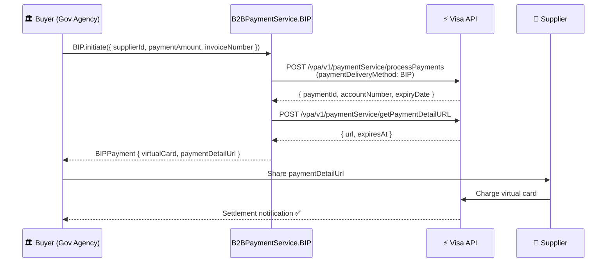

```ts
import { B2BPaymentService } from '@visa-gov/sdk';

const b2b = B2BPaymentService.sandbox();

// Buyer provisions a locked virtual card for this invoice
const payment = await b2b.BIP.initiate({
  messageId:     crypto.randomUUID(),
  clientId:      'B2BWS_1_1_9999',
  buyerId:       '9999',
  supplierId:    'SUPP-001',
  paymentAmount: 4_750.00,
  currencyCode:  '840',
  invoiceNumber: 'INV-2026-042',
  memo:          'Q2 medical equipment',
});

console.log(payment.virtualCard?.accountNumber);  // 4xxx xxxx xxxx xxxx
console.log(payment.paymentDetailUrl);            // supplier card-entry URL
```

### SIP — Supplier Initiated Payment

The supplier submits an invoice and waits for the buyer to approve.

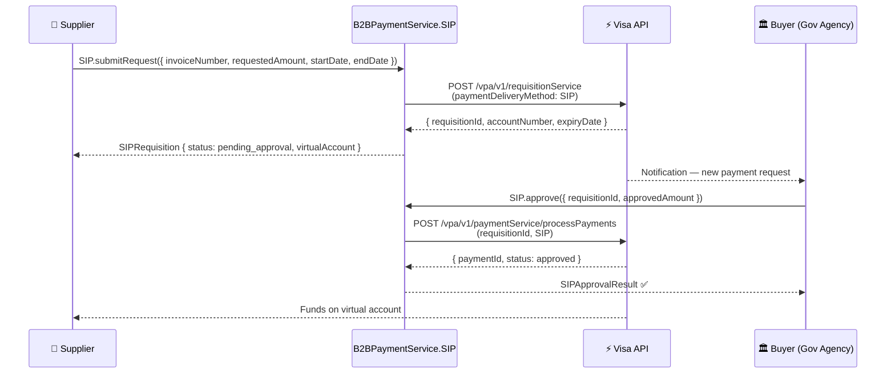

```ts
// Supplier side
const req = await b2b.SIP.submitRequest({
  messageId:       crypto.randomUUID(),
  clientId:        'B2BWS_1_1_9999',
  supplierId:      'SUPP-001',
  buyerId:         '9999',
  requestedAmount: 2_300.00,
  currencyCode:    '840',
  invoiceNumber:   'INV-SUPP-2026-007',
  startDate:       '2026-04-01',
  endDate:         '2026-04-30',
});

// Buyer side — approve and settle
const result = await b2b.SIP.approve({
  messageId:      crypto.randomUUID(),
  clientId:       'B2BWS_1_1_9999',
  buyerId:        '9999',
  requisitionId:  req.requisitionId,
  approvedAmount: 2_300.00,
  currencyCode:   '840',
});
```

### BIP vs SIP — at a glance

| | BIP (Buyer Initiated) | SIP (Supplier Initiated) |
|---|---|---|
| **Who starts it** | Buyer | Supplier |
| **Card direction** | Buyer provisions → pushed to supplier | VPA provisions → issued to supplier |
| **Use case** | POs, fixed-cost contracts | Invoice-driven, milestone billing |
| **SDK method** | `b2b.BIP.initiate()` | `b2b.SIP.submitRequest()` + `.approve()` |

---

## 4 · Visa Supplier Match Service (SMS)

> One API call returns whether a supplier accepts Visa, at what confidence level, and their MCC code — flowing directly into the AI scoring model.

### How it works

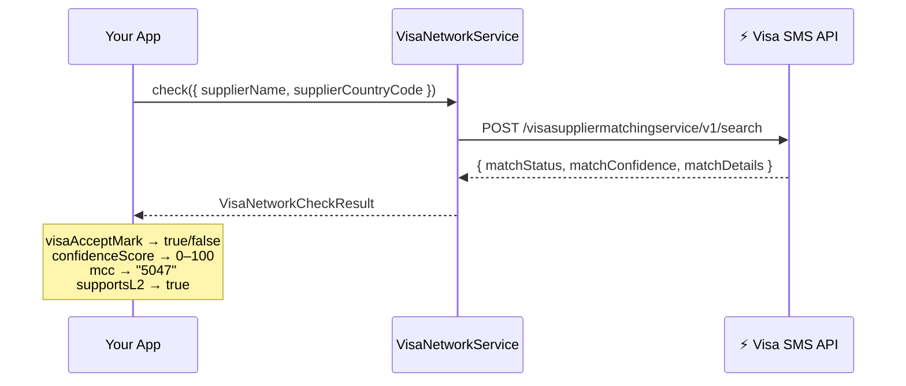

### Confidence → Score mapping

```
matchConfidence   matchStatus   visaMatchScore   Meaning
──────────────────────────────────────────────────────────────
High              Yes           ████████████ 95  Strongly registered
Medium            Yes           ████████     70  Registered, lower certainty
Low               Yes           █████        45  Possibly registered
None / No         No            ░░░░░░░░░░░░  0  Not found
```

### Code

```ts
import { VisaNetworkService } from '@visa-gov/sdk';

const visa = VisaNetworkService.sandbox();

// Single check
const result = await visa.check({
  supplierName:        'MedEquip Co.',
  supplierCountryCode: 'US',
  supplierCity:        'New York',
});
console.log(result.visaAcceptMark);   // true
console.log(result.confidenceScore);  // 95
console.log(result.mcc);              // "5047"

// Batch check (parallel, ≤10 concurrent)
const batch = await visa.bulkCheck([
  { supplierName: 'MedEquip Co.',        supplierCountryCode: 'US' },
  { supplierName: 'HealthTech Supplies', supplierCountryCode: 'US' },
  { supplierName: 'Budget Supplies Co',  supplierCountryCode: 'US' },
]);
// MedEquip Co.:        score=95  MCC=5047
// HealthTech Supplies: score=95  MCC=5047
// Budget Supplies Co:  score=0   MCC=          ← not registered

// Enrich supplier domain objects in bulk
const enriched = await visa.enrichSuppliers(suppliers, 'US');
```

**Connect to the real Visa SMS API:**

```ts
const visa = new VisaNetworkService({
  baseUrl:  'https://sandbox.api.visa.com',
  userId:   process.env.VISA_USER_ID!,
  password: process.env.VISA_PASSWORD!,
  cert:     fs.readFileSync('./certs/cert.pem', 'utf-8'),
  key:      fs.readFileSync('./certs/privateKey-....pem', 'utf-8'),
  ca:       caBundle,
});
```

---

## 5 · AI Supplier Evaluation

> A transparent, auditable AI scoring engine that evaluates every bid across 6 weighted dimensions — including live Visa network verification — and generates a plain-English narrative.

### Scoring model

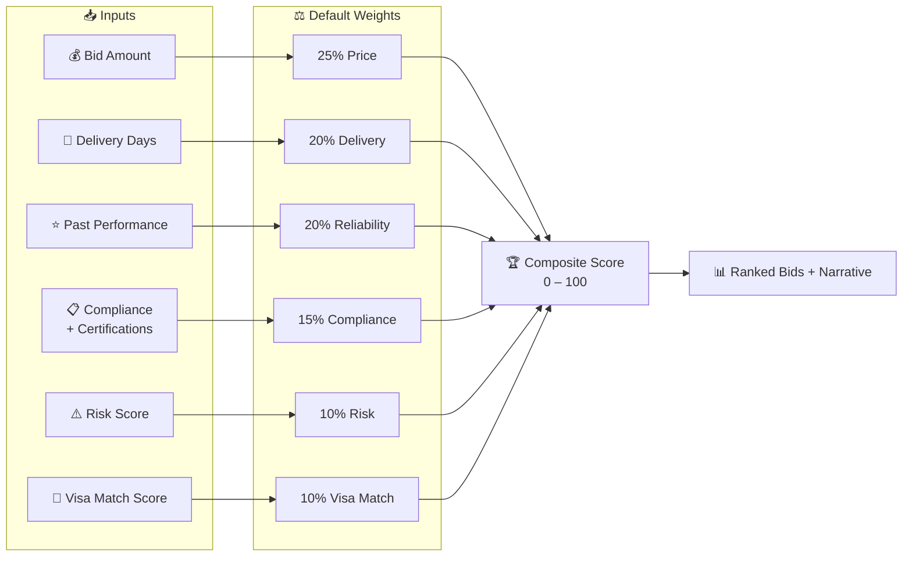

### Code

```ts
import { SupplierMatcher, VisaNetworkService } from '@visa-gov/sdk';

// Basic evaluation
const matcher = new SupplierMatcher();
const result  = matcher.evaluate({
  rfp: { id: 'rfp-001', budgetCeiling: 50_000 },
  bids,
  suppliers,
});

console.log(result.winner.supplier.name);  // "MedEquip Co."
console.log(result.winner.composite);      // 87
console.log(result.narrative);
// "MedEquip Co. leads with a composite score of 87/100,
//  reflecting strong overall performance…"

// With live Visa registry verification
const matcher = SupplierMatcher.withVisaNetwork(VisaNetworkService.sandbox());
const { rankedBids, winner, visaChecks } = await matcher.evaluateWithVisaCheck({
  rfp: { id: 'rfp-001', budgetCeiling: 50_000 },
  bids,
  suppliers,
  countryCode: 'US',
});

for (const sb of rankedBids) {
  const vc = visaChecks.get(sb.supplier.id);
  console.log(`#${sb.rank}  ${sb.supplier.name}  composite=${sb.composite}  visaScore=${sb.dimensions.visaMatchScore}  MCC=${vc?.mcc}`);
}
// #1  MedEquip Co.             composite=83  visaScore=95  MCC=5047
// #2  HealthTech Supplies      composite=72  visaScore=95  MCC=5047
// #3  BudgetMed LLC            composite=58  visaScore=0   MCC=

// Custom weights (auto-normalised to sum 1.0)
const priceFocused = SupplierMatcher.withWeights({ price: 0.50 });
```

### End-to-end `evaluateWithVisaCheck` flow

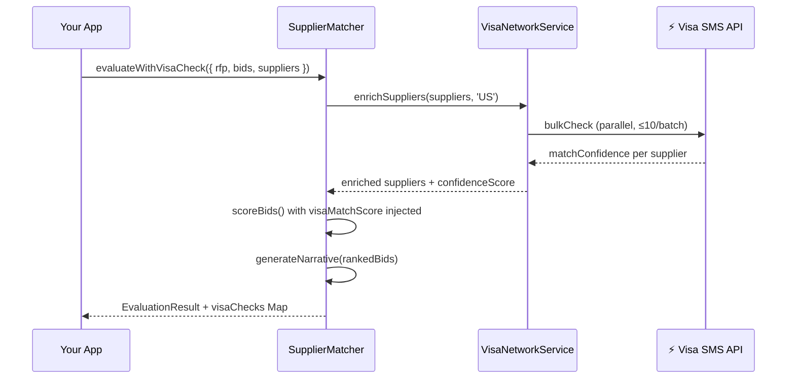

---

## 6 · Visa B2B Payment Controls (VPC)

> Every transaction against a virtual card is evaluated against your rule set *before* it's approved — spend velocity, merchant category, channel, location, and business hours.

### Account state machine

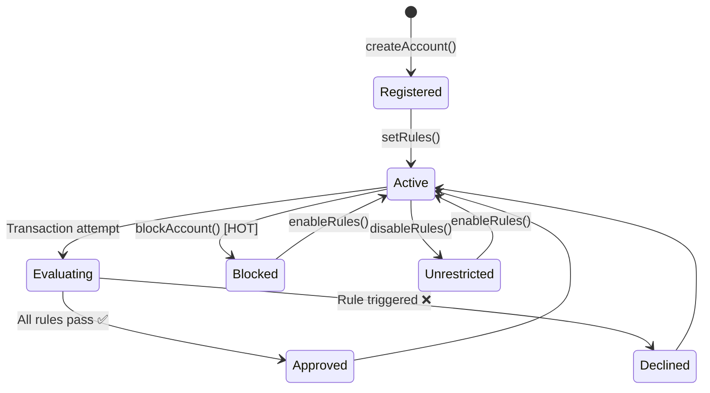

### Rule categories

```
┌──────────────────────────────────────────────────────────┐
│                   VPC Rule Engine                        │
├──────────────┬───────────────────────────────────────────┤
│ 💰 Spending  │ SPV  Spend velocity (period + auth count) │
│              │ SPP  Max single-transaction amount        │
│              │ VPAS Exact amount match                   │
├──────────────┼───────────────────────────────────────────┤
│ 🏪 Merchant  │ MCC  Allow/block by category code         │
│              │ MCG  Allow/block by category group        │
├──────────────┼───────────────────────────────────────────┤
│ 📡 Channel   │ CHN  Online / POS / ATM / Contactless     │
├──────────────┼───────────────────────────────────────────┤
│ 🌍 Location  │ LOC  Country allow / block list           │
├──────────────┼───────────────────────────────────────────┤
│ 🕐 Time      │ BHR  Days of week + time range            │
├──────────────┼───────────────────────────────────────────┤
│ 🚫 Emergency │ HOT  Block ALL transactions instantly     │
└──────────────┴───────────────────────────────────────────┘
```

### Code

```ts
import { VPCService } from '@visa-gov/sdk';

const vpc = VPCService.sandbox();

// 1 · Register the virtual card
const account = await vpc.AccountManagement.createAccount({
  accountNumber: '4111111111111111',
  contacts: [{ name: 'Procurement Officer', email: 'proc@agency.gov', notifyOn: ['transaction_declined'] }],
});

// 2 · Set real-time rules
await vpc.Rules.setRules(account.accountId, [
  { ruleCode: 'SPV', spendVelocity: { limitAmount: 50_000, currencyCode: '840', periodType: 'monthly', maxAuthCount: 20 } },
  { ruleCode: 'SPP', spendPolicy:   { maxTransactionAmount: 10_000, currencyCode: '840' } },
  { ruleCode: 'MCC', mcc:           { allowedMCCs: ['5047', '5122', '8099'] } },
  { ruleCode: 'CHN', channel:       { allowOnline: false, allowPOS: true, allowATM: false } },
  { ruleCode: 'BHR', businessHours: { allowedDays: [1,2,3,4,5], startTime: '08:00', endTime: '18:00', timezone: 'America/New_York' } },
]);

// 3 · Emergency block / unblock
await vpc.Rules.blockAccount(account.accountId);   // 🚫 HOT — instant block
await vpc.Rules.enableRules(account.accountId);    // ✅ re-enable

// 4 · Report on declined transactions
const declined = await vpc.Reporting.getTransactionHistory(account.accountId, { outcome: 'declined' });
for (const t of declined) {
  console.log(`❌ $${t.amount} @ ${t.merchantName} — Rule: [${t.declineReason}] ${t.declineMessage}`);
}
```

---

## 7 · IPC — Intelligent Payment Controls (Gen-AI)

> Describe card usage in plain English. Gen-AI translates your intent into a ready-to-apply `VPCRule[]` with a rationale and confidence score.

### How it works

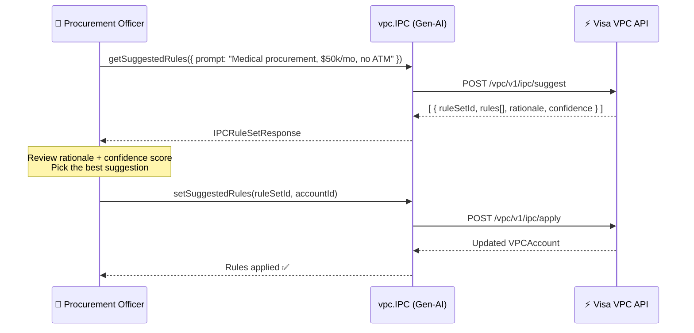

### From prompt to rule set

```
Prompt: "Medical equipment procurement, max $50k/month, domestic, no ATM"
                               │
                   ┌───────────▼──────────┐
                   │   Gen-AI Rule Engine  │
                   │  • Category → Medical │
                   │  • Limit    → $50,000 │
                   │  • Channel  → no ATM  │
                   │  • Geography→ domestic│
                   └───────────┬──────────┘
                               │
          ┌────────────────────▼────────────────────┐
          │         Suggested Rule Set               │
          │  ruleSetId:  ipc-tpl-medical             │
          │  confidence: 94 / 100                    │
          │                                          │
          │  rules:                                  │
          │  • SPV  $50,000/month · max 50 auths     │
          │  • MCC  allow [5047, 5122, 8099, 8049]   │
          │  • CHN  POS=✓  Online=✓  ATM=✗           │
          │                                          │
          │  rationale:                              │
          │  "Medical procurement: healthcare MCCs   │
          │   allowed; $50,000/month; POS and        │
          │   online; ATM blocked."                  │
          └─────────────────────────────────────────┘
```

### Built-in sandbox templates

| Keyword in prompt | Template | Confidence | Monthly limit |
|-------------------|----------|:----------:|:-------------:|
| `medical`, `health`, `pharma` | Medical Procurement | 94% | $50,000 |
| `travel`, `airline`, `hotel` | Travel | 88% | $10,000 |
| `office`, `stationery`, `supplies` | Office Supplies | 91% | $2,000 |
| `IT`, `software`, `cloud`, `tech` | IT Services | 89% | $25,000 |
| *(anything else)* | General Purpose | 75% | $5,000 |

### Code

```ts
// Get AI-generated rule suggestions
const { suggestions } = await vpc.IPC.getSuggestedRules({
  prompt:       'Medical equipment procurement, max $50k per month, no ATM',
  currencyCode: '840',
});

console.log(suggestions[0].confidence);  // 94
console.log(suggestions[0].rationale);
// "Medical procurement: healthcare MCCs allowed; $50,000/month; POS and online; ATM blocked."

// Apply with one call — rules go live in near real-time
await vpc.IPC.setSuggestedRules(suggestions[0].ruleSetId, account.accountId);
```

---

## 8 · Settlement

> After a virtual card purchase, `SettlementService` models the full Visa settlement lifecycle with streaming state for real-time UI updates.

### Settlement flow

```
  Initiated ──────────────────────────────────── Settled
     │                  │                  │         │
     ●──────────────────●──────────────────●─────────●
  [idle]         [authorized]       [processing]  [settled]
    0%               33%                66%          100%
```

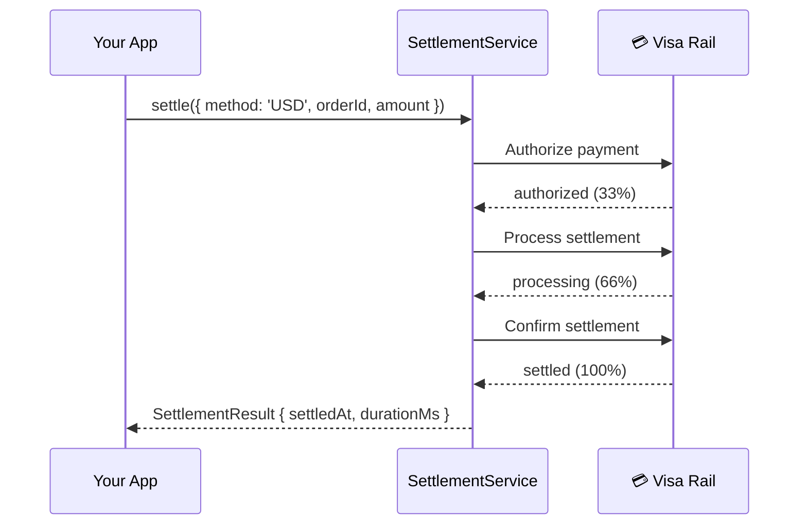

### Code

```ts
import { SettlementService } from '@visa-gov/sdk';

const service = new SettlementService();

// Automated (fire-and-forget)
const result = await service.settle({ method: 'USD', orderId: 'ORD-001', amount: 48_500 });
console.log(`Settled in ${result.durationMs}ms at ${result.settledAt}`);

// Streaming (real-time UI updates)
const session = service.initiate({ method: 'Card', orderId: 'ORD-002', amount: 12_000 });

for await (const state of session.stream(1_500)) {  // 1.5s per step
  console.log(`${state.progress}% — ${state.currentStep}`);
  updateProgressBar(state.progress);
}
// 33% — authorized
// 66% — processing
// 100% — settled
```

---

## End-to-end: Full Government Procurement Flow

> From supplier discovery to payment settlement in a single script.

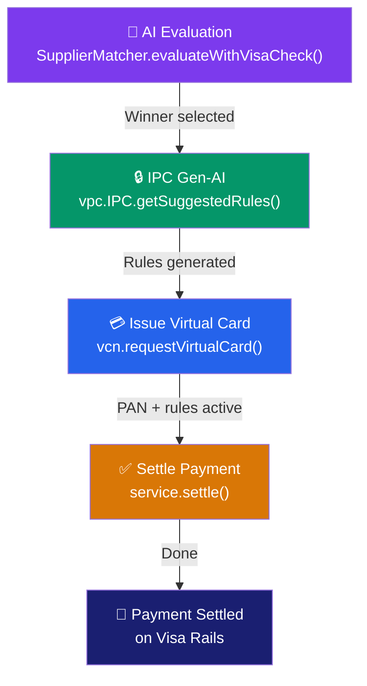

```ts
import {
  SupplierMatcher, VisaNetworkService, VCNService,
  VPCService, SettlementService, buildSPVRule,
} from '@visa-gov/sdk';

const rfp = { id: 'rfp-001', budgetCeiling: 50_000 };

// 1 · Score suppliers with live Visa verification
const matcher = SupplierMatcher.withVisaNetwork(VisaNetworkService.sandbox());
const { winner } = await matcher.evaluateWithVisaCheck({ rfp, bids, suppliers });
console.log(`🏆 Winner: ${winner.supplier.name} (${winner.composite}/100)`);

// 2 · Use IPC Gen-AI to configure the card controls
const vpc     = VPCService.sandbox();
const account = await vpc.AccountManagement.createAccount({ accountNumber: '4111...' });
const { suggestions } = await vpc.IPC.getSuggestedRules({ prompt: 'Medical procurement, max $50k' });
await vpc.IPC.setSuggestedRules(suggestions[0].ruleSetId, account.accountId);

// 3 · Issue a virtual card for the winning supplier
const vcn  = new VCNService();
const card = await vcn.requestVirtualCard({
  clientId: 'GOV-001', buyerId: '9999',
  messageId: Date.now().toString(), action: 'A', numberOfCards: '1',
  proxyPoolId: 'POOL-01',
  requisitionDetails: {
    startDate: '2025-06-01', endDate: '2025-06-30', timeZone: 'UTC-5',
    rules: [buildSPVRule({ spendLimitAmount: winner.bid.amount, maxAuth: 3, currencyCode: '840', rangeType: 'monthly' })],
  },
});
console.log(`💳 Card: **** **** **** ${card.accounts[0].accountNumber.slice(-4)}`);

// 4 · Settle the payment
const result = await new SettlementService().settle({
  method: 'USD', orderId: `ORD-${rfp.id}`, amount: winner.bid.amount,
});
console.log(`✅ Settled $${result.amount.toLocaleString()} in ${result.durationMs}ms`);
```

---

## mTLS Connectivity

All Visa B2B APIs require **Two-Way SSL (mutual TLS)**. Use `createMtlsFetch` to build a pre-authenticated fetch function:

```ts
import { createMtlsFetch } from '@visa-gov/sdk';
import fs from 'fs';

const mtlsFetch = createMtlsFetch({
  cert: fs.readFileSync('./certs/cert.pem', 'utf-8'),
  key:  fs.readFileSync('./certs/privateKey-....pem', 'utf-8'),
  ca:   [
    fs.readFileSync('./certs/DigiCertGlobalRootG2.crt.pem', 'utf-8'),
    fs.readFileSync('./certs/SBX-2024-Prod-Root.pem', 'utf-8'),
    fs.readFileSync('./certs/SBX-2024-Prod-Inter.pem', 'utf-8'),
  ].join('\n'),
});

const visa = new VisaNetworkService({ baseUrl, userId, password, fetch: mtlsFetch });
```

Test connectivity:

```bash
node helloworld.js
# Visa Developer Platform — Hello World
# HTTP Status : 200
# { "message": "helloworld" }
# Connectivity test PASSED ✓
```

---

## API Reference

<details>
<summary>📘 VCNService</summary>

| Method | Returns | Description |
|--------|---------|-------------|
| `requestVirtualCard(payload, options?)` | `Promise<VCNRequestResponse>` | Issue virtual card(s) via Visa B2B VPA API |

</details>

<details>
<summary>📘 VPAService</summary>

| Sub-service | Key methods |
|-------------|-------------|
| `vpa.Buyer` | `createBuyer`, `updateBuyer`, `getBuyer`, `createTemplate`, `updateTemplate`, `getTemplate` |
| `vpa.FundingAccount` | `addFundingAccount`, `getFundingAccount`, `getSecurityCode`, `requestVirtualAccount`, `getAccountStatus`, `getPaymentControls`, `managePaymentControls` |
| `vpa.ProxyPool` | `createProxyPool`, `updateProxyPool`, `getProxyPool`, `deleteProxyPool`, `manageProxyPool` |
| `vpa.Supplier` | `createSupplier`, `updateSupplier`, `getSupplier`, `disableSupplier`, `manageSupplierAccount` |
| `vpa.Payment` | `processPayment`, `getPaymentDetails`, `resendPayment`, `cancelPayment`, `getPaymentDetailURL`, `createRequisition` |

</details>

<details>
<summary>📘 B2BPaymentService</summary>

| Sub-service | Key methods |
|-------------|-------------|
| `b2b.BIP` | `initiate`, `resend`, `getStatus`, `cancel` |
| `b2b.SIP` | `submitRequest`, `approve`, `reject` |

</details>

<details>
<summary>📘 VisaNetworkService</summary>

| Method | Returns | Description |
|--------|---------|-------------|
| `VisaNetworkService.sandbox()` | `VisaNetworkService` | Sandbox instance |
| `new VisaNetworkService(config)` | `VisaNetworkService` | Live instance |
| `check(request)` | `Promise<VisaNetworkCheckResult>` | Single supplier check |
| `bulkCheck(requests)` | `Promise<Map<name, result>>` | Parallel batch check |
| `enrichSupplier(supplier)` | `Promise<Supplier & { visaNetwork }>` | Add Visa data to supplier |
| `enrichSuppliers(suppliers, countryCode?)` | `Promise<EnrichedSupplier[]>` | Batch enrich |

</details>

<details>
<summary>📘 SupplierMatcher</summary>

| Method | Returns | Description |
|--------|---------|-------------|
| `evaluate({ rfp, bids, suppliers })` | `EvaluationResult` | Score + rank all bids |
| `evaluateWithVisaCheck(params)` | `Promise<EvaluationResult & { visaChecks }>` | Evaluate with live SMS verification |
| `scoreBids(bids, suppliers, rfp, visaScores?)` | `ScoredBid[]` | Score without wrapper |
| `scoreBid(bid, supplier, rfp, visaMatchScore?)` | `Partial<ScoredBid>` | Score single bid |
| `generateNarrative(ranked)` | `string` | AI explanation of winner |
| `generateOverrideNarrative(selected, best)` | `string` | Override warning |
| `getWeights()` | `ScoringWeights` | Active weight configuration |
| `SupplierMatcher.withWeights(partial)` | `SupplierMatcher` | Custom weights |
| `SupplierMatcher.withVisaNetwork(service)` | `SupplierMatcher` | Backed by Visa SMS |

</details>

<details>
<summary>📘 VPCService</summary>

| Sub-service | Key methods |
|-------------|-------------|
| `vpc.AccountManagement` | `createAccount`, `getAccount`, `updateAccount`, `deleteAccount` |
| `vpc.Rules` | `setRules`, `getRules`, `deleteRules`, `blockAccount`, `disableRules`, `enableRules` |
| `vpc.Reporting` | `getNotificationHistory`, `getTransactionHistory`, `injectTransaction` |
| `vpc.IPC` | `getSuggestedRules(prompt)`, `setSuggestedRules(ruleSetId, accountId)` |
| `vpc.SupplierValidation` | `registerSupplier`, `updateSupplier`, `retrieveSupplier` |

</details>

<details>
<summary>📘 SettlementService</summary>

| Method | Returns | Description |
|--------|---------|-------------|
| `initiate(params)` | `SettlementSession` | Create session |
| `settle(params, delayMs?)` | `Promise<SettlementResult>` | Auto-run full settlement |
| `getStepLabel(step)` | `string` | Human-readable step label |
| `session.advance()` | `SettlementState` | Move to next step |
| `session.stream(delayMs?)` | `AsyncGenerator` | Yield state after each step |
| `session.isSettled()` | `boolean` | True when complete |
| `session.reset()` | `void` | Reset to idle |

</details>

---


