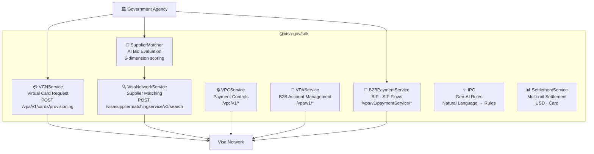
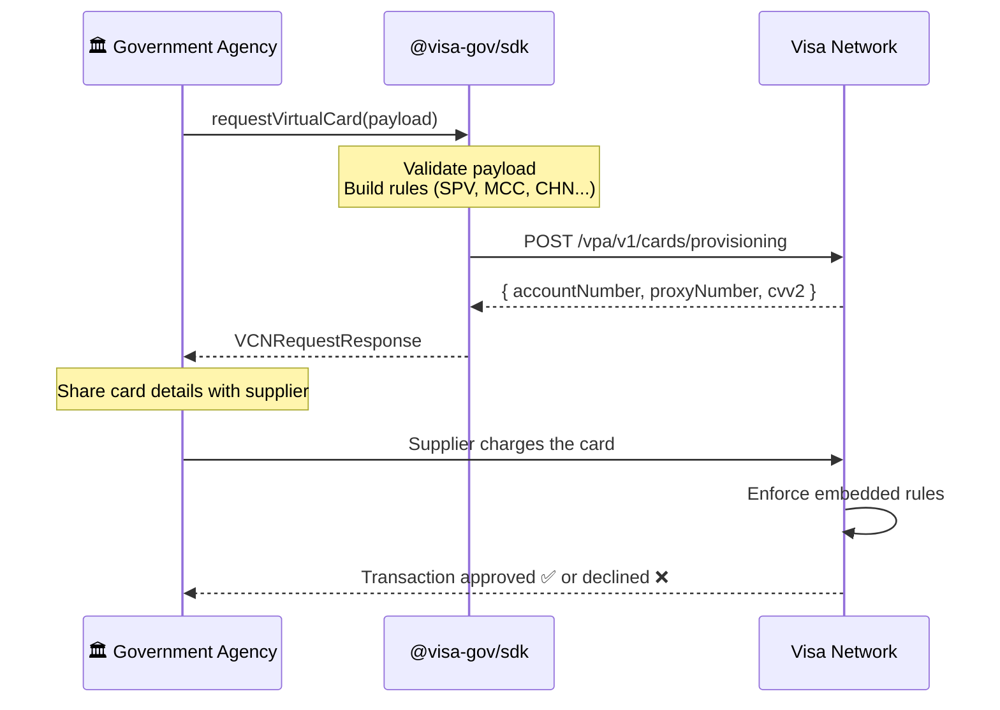
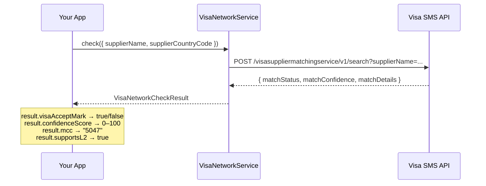
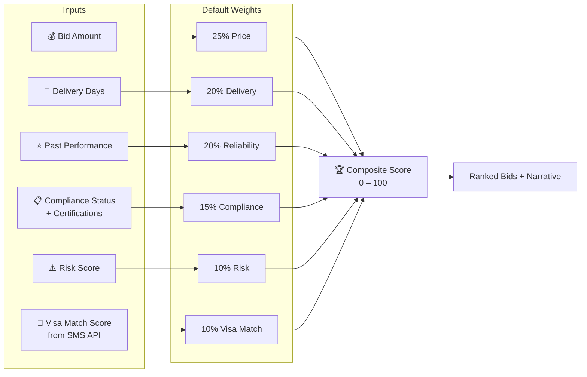
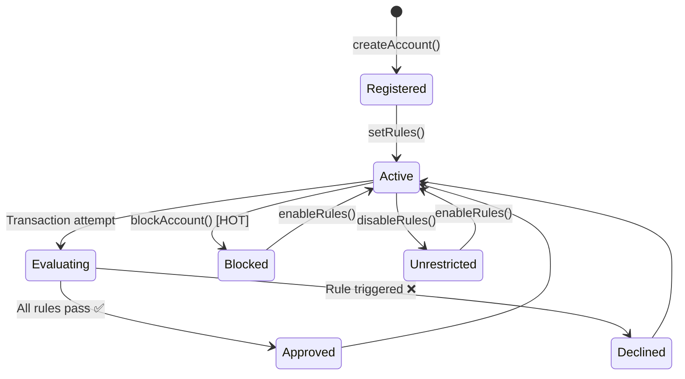

<div align="center">

# 🏛️ @visa-gov/sdk

### The TypeScript SDK powering AI-driven Government Procurement on the Visa Network

[](https://www.typescriptlang.org/)
[](https://developer.visa.com)
[](./test-sdk.ts)
[](./LICENSE)

*From supplier discovery to virtual card issuance — in a single SDK.*

</div>

---

## What is this?

Government procurement is slow, opaque, and expensive. This SDK wires the full Visa B2B payment infrastructure into a single TypeScript package — letting agencies go from **publishing an RFP** to **settling a payment** in one coherent flow, with AI-powered supplier scoring and real-time payment controls at every step.

```
📋 RFP published
   ↓
🤖 Suppliers scored with AI  +  Visa network verification
   ↓
💳 Virtual card issued with embedded spending rules
   ↓
🔒 Payment Controls enforced in real-time
   ↓
✅ Payment settled on Visa rails
```

---

## Architecture



---

## Installation

```bash
npm install git+https://github.com/ericomack1983/visa-gov-sdk.git
```

```ts
import {
  VCNService,
  VPAService,
  VisaNetworkService,
  SupplierMatcher,
  VPCService,
  SettlementService,
} from '@visa-gov/sdk';
```

Run the full test suite:

```bash
npx tsx test-sdk.ts       # 100 assertions — all services
node test-visa-sms.js     # live Visa SMS API — 11 assertions
node test-vpa.js          # live Visa VPA API — 28 endpoints
node test-bip-sip.js      # live Visa BIP & SIP — 10 endpoints
node helloworld.js        # mTLS connectivity check
```

---

## Feature Guide

| # | Feature | What it does | Real API |
|---|---------|-------------|---------|
| [1](#1--b2b-virtual-account-payments) | **B2B Virtual Account Payments** | Issue virtual cards with embedded spending rules | `POST /vpa/v1/cards/provisioning` |
| [2](#2--full-vpa-account-management) | **Full VPA Account Management** | Buyers, funding accounts, proxy pools, suppliers, payments | `/vpa/v1/*` |
| [3](#3--bip--sip-payment-flows) | **BIP & SIP Payment Flows** | Buyer-initiated and Supplier-initiated B2B payment flows | `POST /vpa/v1/paymentService/*` |
| [4](#4--visa-supplier-match-service-sms) | **Visa Supplier Match Service** | Verify suppliers in the Visa network, get match score | `POST /visasuppliermatchingservice/v1/search` |
| [5](#5--ai-supplier-evaluation) | **AI Supplier Evaluation** | Score & rank bids across 6 weighted dimensions | SDK-internal |
| [6](#6--visa-b2b-payment-controls-vpc) | **Visa B2B Payment Controls** | Real-time spending rules on every virtual card | `/vpc/v1/*` |
| [7](#7--ipc--intelligent-payment-controls-gen-ai) | **IPC — Gen-AI Rules** | Natural language → payment control rules | `POST /vpc/v1/ipc/suggest` |
| [8](#8--settlement) | **Settlement** | Multi-rail payment settlement with streaming | SDK-internal |

---

## 1 · B2B Virtual Account Payments

> **The problem:** Paying a supplier used to mean a wire transfer, a check, or a corporate card with no spending controls. Any of those could be misused, delayed, or untraceable.
>
> **The solution:** Issue a *virtual card number* (PAN) that only works for a specific supplier, amount range, time window, and merchant category — and expires automatically when the purchase is done.

### How it works



### Code

```ts
import { VCNService, buildSPVRule, buildBlockRule, buildAmountRule } from '@visa-gov/sdk';

const vcn = new VCNService();  // sandbox — no credentials needed

const response = await vcn.requestVirtualCard({
  clientId:      'B2BWS_1_1_9999',
  buyerId:       '9999',
  messageId:     Date.now().toString(),
  action:        'A',
  numberOfCards: '1',
  proxyPoolId:   'Proxy12345',
  requisitionDetails: {
    startDate: '2025-06-01',
    endDate:   '2025-06-30',
    timeZone:  'UTC-5',
    rules: [
      buildSPVRule({ spendLimitAmount: 50_000, maxAuth: 5, currencyCode: '840', rangeType: 'monthly' }),
      buildAmountRule('PUR', 10_000, '840'),   // max $10k per transaction
      buildBlockRule('ECOM'),                   // no online purchases
      buildBlockRule('ATM'),                    // no cash withdrawals
    ],
  },
});

console.log(response.responseCode);              // "00" = success
console.log(response.accounts[0].accountNumber); // Virtual card PAN
console.log(response.accounts[0].expiryDate);    // MM/YYYY
console.log(response.accounts[0].proxyNumber);   // Proxy reference
```

**Connect to the live Visa API:**

```ts
const response = await vcn.requestVirtualCard(payload, {
  baseUrl:     'https://sandbox.api.visa.com',
  credentials: { userId: process.env.VISA_USER_ID!, password: process.env.VISA_PASSWORD! },
  tls: {
    cert: fs.readFileSync('./certs/cert.pem', 'utf-8'),
    key:  fs.readFileSync('./certs/privateKey-....pem', 'utf-8'),
    ca:   caBundle,
  },
});
```

### Rule reference

<details>
<summary>📋 Expand rule code reference</summary>

| Code | Category | Description |
|------|----------|-------------|
| `SPV` | Spending | Spend velocity — rolling period limit + auth count cap |
| `PUR` | Spending | Single-purchase amount cap |
| `EAM` | Spending | Exact amount match — card authorised only for this amount |
| `VPAS` | Spending | Virtual payment account specific — exact match with tolerance |
| `TOLRNC` | Spending | Tolerance band — min/max delta around expected amount |
| `XBRA` | Spending | Cross-border amount cap |
| `ATML` | Spending | ATM cash withdrawal limit |
| `CAID` | Merchant | Lock card to a single Card Acceptor ID |
| `HOT` | Merchant | Block hotels / lodging |
| `AUTO` | Merchant | Block auto dealers / rentals |
| `AIR` | Merchant | Block airlines |
| `ECOM` | Channel | Block e-commerce / online |
| `ATM` | Channel | Block ATM cash withdrawals |
| `CNP` | Channel | Block card-not-present |
| `XBR` | Channel | Block cross-border transactions |
| `NOC` | Other | No controls — open card |

</details>

---

## 2 · Full VPA Account Management

> **The B2B Virtual Account Payment (VPA) lifecycle** — from onboarding a buyer to reconciling payments — is fully modelled through `VPAService`. Each step maps 1:1 to a Visa API endpoint.

### The full procurement payment lifecycle

```mermaid
flowchart LR
    A["🏛️ Create Buyer\n/buyerManagement/buyer/create"] -->
    B["🏦 Add Funding Account\n/accountManagement/fundingAccount/add"] -->
    C["🗂️ Create Proxy Pool\n/suaPoolMaintenance/proxyPool/create"] -->
    D["🏢 Onboard Supplier\n/supplierManagement/supplier/create"] -->
    E["💳 Issue Virtual Card\n/accountManagement/VirtualCardRequisition"] -->
    F["💸 Process Payment\n/paymentService/processPayments"] -->
    G["📊 Reconcile\n/paymentService/getPaymentDetails"]
```



```ts
import { VPAService } from '@visa-gov/sdk';

const vpa = new VPAService({ baseUrl, credentials, tls });  // or VPAService.sandbox()

// 1 — Create a buyer (government agency profile)
const buyer = await vpa.Buyer.createBuyer({
  clientId:   'GOV-AGENCY-001',
  buyerName:  'Ministry of Health',
  currencyCode: '840',
});

// 2 — Add the agency's funding bank account
const account = await vpa.FundingAccount.addFundingAccount({
  clientId: buyer.clientId,
  buyerId:  buyer.buyerId,
  accountNumber: '4111111111111111',
});

// 3 — Create a proxy pool (pre-provisioned card numbers)
const pool = await vpa.ProxyPool.createProxyPool({
  clientId:    buyer.clientId,
  proxyPoolId: 'HEALTH-POOL-2025',
  size:        100,
});

// 4 — Onboard a supplier
const supplier = await vpa.Supplier.createSupplier({
  clientId:     buyer.clientId,
  supplierName: 'MedEquip Co.',
  accountNumber: '4222222222222222',
});

// 5 — Issue a virtual card for the purchase
const requisition = await vpa.FundingAccount.requestVirtualAccount({
  clientId:   buyer.clientId,
  buyerId:    buyer.buyerId,
  proxyPoolId: pool.proxyPoolId,
  amount:     48_500,
  currencyCode: '840',
});

// 6 — Process the payment to the supplier
const payment = await vpa.Payment.processPayment({
  clientId:   buyer.clientId,
  buyerId:    buyer.buyerId,
  supplierId: supplier.supplierId,
  amount:     48_500,
  currencyCode: '840',
  paymentMethod: 'SIP',
});
```

---

## 3 · BIP & SIP Payment Flows

> **The problem:** Not all B2B payments start the same way. Sometimes the *buyer* wants to push a locked virtual card to a supplier before any charge is made (BIP). Other times the *supplier* presents an invoice and waits for the buyer to authorise it (SIP). Both flows are built on the same Visa VPA rails but follow opposite directions of initiation.
>
> **The solution:** `B2BPaymentService` exposes two focused sub-services — `.BIP` and `.SIP` — each modelling the exact API call sequence Visa defines for that delivery method.

### BIP — Buyer Initiated Payment

The buyer is in full control. They provision a single-use virtual card locked to the invoice amount and push it to the supplier before any charge happens.

```
  BUYER                          VISA API                        SUPPLIER
    │                               │                               │
    │  initiate({ supplierId,       │                               │
    │    paymentAmount, invoice })  │                               │
    │──────────────────────────────►│  POST /paymentService/        │
    │                               │    processPayments            │
    │                               │    (paymentDeliveryMethod:BIP)│
    │                               │◄──────────────────────────────│
    │◄──────────────────────────────│  paymentId + virtualCard PAN  │
    │                               │                               │
    │  getPaymentDetailURL()        │                               │
    │──────────────────────────────►│  POST /getPaymentDetailURL    │
    │◄── { url, expiresAt } ───────│                               │
    │                               │                               │
    │  Share URL with supplier ─────┼──────────────────────────────►│
    │                               │                               │
    │                               │  Supplier charges virtual card│
    │                               │◄──────────────────────────────│
    │                               │  Visa enforces spending rules │
    │◄──────────────────────────────│  Transaction settled ✅        │
```


```ts
import { B2BPaymentService } from '@visa-gov/sdk';

const b2b = B2BPaymentService.sandbox();  // or B2BPaymentService.live(apiConfig)

// Step 1 — Buyer provisions a virtual card for this specific invoice
const payment = await b2b.BIP.initiate({
  messageId:     crypto.randomUUID(),
  clientId:      'B2BWS_1_1_9999',
  buyerId:       '9999',
  supplierId:    'SUPP-001',
  paymentAmount: 4_750.00,
  currencyCode:  '840',           // USD
  invoiceNumber: 'INV-2026-042',
  memo:          'Q2 medical equipment',
});

console.log(payment.virtualCard?.accountNumber);  // 4xxx xxxx xxxx xxxx
console.log(payment.virtualCard?.expiryDate);     // MM/YYYY
console.log(payment.paymentDetailUrl);            // supplier card-entry URL
console.log(payment.status);                      // 'pending'

// Step 2 — Resend card notification to supplier if needed
await b2b.BIP.resend({
  messageId: crypto.randomUUID(),
  clientId:  'B2BWS_1_1_9999',
  paymentId: payment.paymentId,
});

// Step 3 — Check current payment status
const status = await b2b.BIP.getStatus({
  messageId: crypto.randomUUID(),
  clientId:  'B2BWS_1_1_9999',
  paymentId: payment.paymentId,
});

// Step 4 — Cancel if unused (only while status is 'pending' or 'unmatched')
await b2b.BIP.cancel({
  messageId: crypto.randomUUID(),
  clientId:  'B2BWS_1_1_9999',
  paymentId: payment.paymentId,
});
```

---

### SIP — Supplier Initiated Payment

The supplier initiates. They submit a payment requisition with their invoice; Visa pre-provisions a virtual account for them and notifies the buyer. The buyer reviews and approves (or rejects) through the SDK.

```
  SUPPLIER                       VISA API                         BUYER
    │                               │                               │
    │  Submit requisition           │                               │
    │  (invoice, amount, dates) ───►│  POST /requisitionService     │
    │                               │  (paymentDeliveryMethod: SIP) │
    │◄── { requisitionId,          │                               │
    │       virtualAccount } ───────│  Notify buyer of pending req ►│
    │                               │                               │
    │                               │  Buyer reviews invoice        │
    │                               │                               │
    │                               │◄──────────────────────────────│
    │                               │  POST /processPayments        │
    │                               │  (requisitionId, SIP)         │
    │◄──────────────────────────────│  { paymentId, status: approved}
    │  Receive payment on           │                               │
    │  virtual account ✅            │                               │
```


```ts
import { B2BPaymentService } from '@visa-gov/sdk';

const b2b = B2BPaymentService.sandbox();

// ── Supplier side ─────────────────────────────────────────────────────────────

const req = await b2b.SIP.submitRequest({
  messageId:       crypto.randomUUID(),
  clientId:        'B2BWS_1_1_9999',
  supplierId:      'SUPP-001',
  buyerId:         '9999',
  requestedAmount: 2_300.00,
  currencyCode:    '840',
  invoiceNumber:   'INV-SUPP-2026-007',
  startDate:       '2026-04-01',
  endDate:         '2026-04-30',
});

console.log(req.requisitionId);                   // SIP-REQ-XXXXXXXX
console.log(req.virtualAccount?.accountNumber);   // pre-provisioned card
console.log(req.status);                          // 'pending_approval'

// ── Buyer side ────────────────────────────────────────────────────────────────

// Approve and trigger settlement
const result = await b2b.SIP.approve({
  messageId:      crypto.randomUUID(),
  clientId:       'B2BWS_1_1_9999',
  buyerId:        '9999',
  requisitionId:  req.requisitionId,
  approvedAmount: 2_300.00,
  currencyCode:   '840',
});

console.log(result.paymentId);   // SIP-PAY-XXXXXXXX
console.log(result.status);      // 'approved'
console.log(result.approvedAt);  // ISO timestamp

// Or reject the request
await b2b.SIP.reject({
  messageId:     crypto.randomUUID(),
  clientId:      'B2BWS_1_1_9999',
  requisitionId: req.requisitionId,
});
```

### BIP vs SIP — when to use which

| | BIP (Buyer Initiated) | SIP (Supplier Initiated) |
|---|---|---|
| **Who starts it** | Buyer | Supplier |
| **Virtual card direction** | Buyer provisions → pushed to supplier | VPA provisions → issued to supplier |
| **Control** | Full buyer control before any charge | Supplier drives; buyer approves |
| **Use case** | Pre-approved purchases, POs, fixed-cost contracts | Invoice-driven payments, milestone billing |
| **Visa endpoint** | `processPayments` + `getPaymentDetailURL` | `requisitionService` + `processPayments` |
| **SDK method** | `b2b.BIP.initiate()` | `b2b.SIP.submitRequest()` + `.approve()` |

---

## 4 · Visa Supplier Match Service (SMS)

> **The problem:** Before paying a supplier with a Visa commercial card, you need to know if they actually accept Visa. More importantly, you want to know *how confidently* they're registered — a supplier with High confidence gets a 95/100 score; None gets 0.
>
> **The solution:** A single API call to the Visa Supplier Matching Service returns `matchStatus`, `matchConfidence`, MCC code, and Level 2/3 data support — and that confidence score flows directly into the AI bid evaluation model.

### How it works



### Confidence → Visa Supplier Match Score

```
matchConfidence  matchStatus   visaMatchScore   Meaning
─────────────────────────────────────────────────────────────
High             Yes           ████████████ 95  Strongly registered
Medium           Yes           ████████     70  Registered, lower certainty
Low              Yes           █████        45  Possibly registered
None / No        No            ░░░░░░░░░░░░  0  Not found
```

### Code

```ts
import { VisaNetworkService } from '@visa-gov/sdk';

const visa = VisaNetworkService.sandbox();  // or new VisaNetworkService(config)

// ── Single check ─────────────────────────────────────────────────────────────
const result = await visa.check({
  supplierName:        'MedEquip Co.',
  supplierCountryCode: 'US',
  supplierCity:        'New York',
  supplierState:       'NY',
  supplierTaxId:       '82-1234567',
});

console.log(result.visaAcceptMark);   // true
console.log(result.confidenceScore);  // 95
console.log(result.mcc);              // "5047" (Medical Equipment)
console.log(result.supportsL2);       // true
console.log(result.isFleetSupplier);  // false

// ── Batch check (parallel, max 10 concurrent) ─────────────────────────────────
const batch = await visa.bulkCheck([
  { supplierName: 'MedEquip Co.',        supplierCountryCode: 'US' },
  { supplierName: 'HealthTech Supplies', supplierCountryCode: 'US' },
  { supplierName: 'Budget Supplies Co',  supplierCountryCode: 'US' },
]);

for (const [name, res] of batch) {
  console.log(`${name}: score=${res.confidenceScore}  MCC=${res.mcc}`);
}
// MedEquip Co.:        score=95  MCC=5047
// HealthTech Supplies: score=95  MCC=5047
// Budget Supplies Co:  score=0   MCC=          ← not registered

// ── Enrich supplier domain objects ───────────────────────────────────────────
const enriched = await visa.enrichSuppliers(suppliers, 'US');
// enriched[0].visaNetwork.confidenceScore → 95
// enriched[0].visaNetwork.visaAcceptMark  → true
```

**Connect to the real Visa SMS API:**

```ts
const visa = new VisaNetworkService({
  baseUrl:  'https://sandbox.api.visa.com',
  userId:   process.env.VISA_USER_ID!,
  password: process.env.VISA_PASSWORD!,
  cert:     fs.readFileSync('./certs/cert.pem', 'utf-8'),
  key:      fs.readFileSync('./certs/privateKey-....pem', 'utf-8'),
  ca:       caBundle,
});
```

---

## 5 · AI Supplier Evaluation

> **The problem:** Government procurement officers receive dozens of bids. Comparing them manually is slow, inconsistent, and prone to bias or corruption.
>
> **The solution:** A transparent, auditable AI scoring engine that evaluates every bid across 6 weighted dimensions — including live Visa network verification — and generates a plain-English narrative explaining the winner.

### Scoring model



### Code

```ts
import { SupplierMatcher, VisaNetworkService } from '@visa-gov/sdk';

// ── Basic evaluation (no Visa check) ─────────────────────────────────────────
const matcher = new SupplierMatcher();

const result = matcher.evaluate({ rfp, bids, suppliers });

console.log(result.winner.supplier.name);  // "MedEquip Co."
console.log(result.winner.composite);      // 87
console.log(result.narrative);
// "MedEquip Co. leads with a composite score of 87/100,
//  reflecting strong overall performance. Their strongest
//  dimension is reliability (92/100). HealthTech Supplies
//  scored 11 points lower, primarily due to weak price (54/100)."

// ── Full evaluation with live Visa registry verification ──────────────────────
const matcher = SupplierMatcher.withVisaNetwork(VisaNetworkService.sandbox());

const { rankedBids, winner, visaChecks } = await matcher.evaluateWithVisaCheck({
  rfp,
  bids,
  suppliers,
  countryCode: 'US',
});

for (const sb of rankedBids) {
  const vc = visaChecks.get(sb.supplier.id);
  console.log(
    `#${sb.rank}  ${sb.supplier.name.padEnd(24)}`,
    `composite=${sb.composite}`,
    `visaScore=${sb.dimensions.visaMatchScore}`,  // 95 / 70 / 0
    `MCC=${vc?.mcc}`,
  );
}
// #1  MedEquip Co.             composite=83  visaScore=95  MCC=5047
// #2  HealthTech Supplies      composite=72  visaScore=95  MCC=5047
// #3  BudgetMed LLC            composite=58  visaScore=0   MCC=

// ── Custom weights ────────────────────────────────────────────────────────────
const priceFocused = SupplierMatcher.withWeights({ price: 0.50, visaMatchScore: 0.05 });
// Weights are auto-normalised to sum 1.0

// ── Override narrative (for audit trail) ─────────────────────────────────────
const warning = matcher.generateOverrideNarrative(result.rankedBids[2], result.winner);
// "⚠ Manual override detected. You selected BudgetMed LLC (rank #3, 58/100)..."
```

### How `evaluateWithVisaCheck` works end-to-end


---

## 6 · Visa B2B Payment Controls (VPC)

> **The problem:** Issuing a virtual card is only half the story. Without real-time controls, the card could be used at the wrong merchant, in the wrong country, over the wrong amount, or at 3am on a Sunday.
>
> **The solution:** Enrol the card in the Visa B2B Payment Controls system. Every transaction is evaluated against your rule set *before* it's approved — spend velocity, merchant category, channel, location, and business hours.

### How it works



### Rule categories

```
┌──────────────────────────────────────────────────────────┐
│                   VPC Rule Engine                        │
├──────────────┬───────────────────────────────────────────┤
│ 💰 Spending  │ SPV  Spend velocity (period + auth count) │
│              │ SPP  Max single-transaction amount        │
│              │ VPAS Exact amount match                   │
├──────────────┼───────────────────────────────────────────┤
│ 🏪 Merchant  │ MCC  Allow/block by category code         │
│              │ MCG  Allow/block by category group        │
├──────────────┼───────────────────────────────────────────┤
│ 📡 Channel   │ CHN  Online / POS / ATM / Contactless     │
├──────────────┼───────────────────────────────────────────┤
│ 🌍 Location  │ LOC  Country allow / block list           │
├──────────────┼───────────────────────────────────────────┤
│ 🕐 Time      │ BHR  Days of week + time range            │
├──────────────┼───────────────────────────────────────────┤
│ 🚫 Emergency │ HOT  Block ALL transactions instantly     │
└──────────────┴───────────────────────────────────────────┘
```

### Code

```ts
import { VPCService } from '@visa-gov/sdk';

const vpc = VPCService.sandbox();  // or VPCService.live({ baseUrl, credentials })

// ── 1. Register the virtual card with VPC ─────────────────────────────────────
const account = await vpc.AccountManagement.createAccount({
  accountNumber: '4111111111111111',
  contacts: [{
    name:     'Procurement Officer',
    email:    'proc@agency.gov',
    notifyOn: ['transaction_declined', 'account_blocked'],
  }],
});

// ── 2. Set rules (applied in near real-time) ──────────────────────────────────
await vpc.Rules.setRules(account.accountId, [
  { ruleCode: 'SPV',  spendVelocity: { limitAmount: 50_000, currencyCode: '840', periodType: 'monthly', maxAuthCount: 20 } },
  { ruleCode: 'SPP',  spendPolicy:   { maxTransactionAmount: 10_000, currencyCode: '840' } },
  { ruleCode: 'MCC',  mcc:           { allowedMCCs: ['5047', '5122', '8099'] } },  // medical only
  { ruleCode: 'CHN',  channel:       { allowOnline: false, allowPOS: true, allowATM: false, allowContactless: false } },
  { ruleCode: 'BHR',  businessHours: { allowedDays: [1,2,3,4,5], startTime: '08:00', endTime: '18:00', timezone: 'America/New_York' } },
]);

// ── 3. Emergency block / unblock ──────────────────────────────────────────────
await vpc.Rules.blockAccount(account.accountId);   // 🚫 HOT — instant block
await vpc.Rules.enableRules(account.accountId);    // ✅ Re-enable

// ── 4. Report on declined transactions ───────────────────────────────────────
const declined = await vpc.Reporting.getTransactionHistory(account.accountId, {
  outcome:  'declined',
  fromDate: '2025-06-01',
});

for (const t of declined) {
  console.log(`❌ $${t.amount} @ ${t.merchantName} — Rule: [${t.declineReason}] ${t.declineMessage}`);
}

// ── 5. Supplier CAID validation ───────────────────────────────────────────────
const validation = await vpc.SupplierValidation.registerSupplier({
  supplierName: 'MedEquip Co.',
  acquirerBin:  '411111',
  caid:         'MEDSUPPLY_001',
  countryCode:  'US',
  mcc:          '5047',
});
// validation.status → 'validated'
```

---

## 7 · IPC — Intelligent Payment Controls (Gen-AI)

> **The problem:** Configuring payment control rules manually requires knowing all the right rule codes, spending limits, MCC codes, and channel flags. Most procurement officers don't have that expertise.
>
> **The solution:** Describe how the card should be used in plain English. IPC's Gen-AI model translates your intent into a ready-to-apply `VPCRule[]` — with a plain-English rationale and a confidence score so you can decide whether to trust it.

### How it works


### From prompt to rules — what happens inside

```
Prompt: "Medical equipment procurement, max $50k per month, domestic only, no ATM"
                               │
                   ┌───────────▼───────────┐
                   │   Gen-AI Rule Engine   │
                   │  Identifies intent:    │
                   │  • Category → Medical  │
                   │  • Limit    → $50,000  │
                   │  • Channel  → no ATM   │
                   │  • Geography→ domestic │
                   └───────────┬───────────┘
                               │
          ┌────────────────────▼────────────────────┐
          │         Suggested Rule Set               │
          │  ruleSetId:  'ipc-tpl-medical'           │
          │  confidence: 94 / 100                    │
          │                                          │
          │  rules:                                  │
          │  • SPV  $50,000/month, max 50 auths      │
          │  • MCC  allow [5047, 5122, 8099, 8049]   │
          │  • CHN  POS=✓  Online=✓  ATM=✗           │
          │                                          │
          │  rationale:                              │
          │  "Medical procurement: healthcare MCCs   │
          │   allowed; $50,000/month; POS and        │
          │   online; ATM blocked."                  │
          └─────────────────────────────────────────┘
```

### Built-in templates (sandbox)

| Keyword in prompt | Template | Confidence | Monthly limit |
|-------------------|----------|------------|---------------|
| `medical`, `health`, `pharma` | Medical Procurement | 94% | $50,000 |
| `travel`, `airline`, `hotel` | Travel | 88% | $10,000 |
| `office`, `stationery`, `supplies` | Office Supplies | 91% | $2,000 |
| `IT`, `software`, `cloud`, `tech` | IT Services | 89% | $25,000 |
| *(anything else)* | General Purpose | 75% | $5,000 |

### Code

```ts
// ── Step 1: Get suggestions ───────────────────────────────────────────────────
const { suggestions } = await vpc.IPC.getSuggestedRules({
  prompt:       'Medical equipment procurement, max $50k per month, no ATM',
  currencyCode: '840',
});

// Inspect what the AI generated
console.log(suggestions[0].confidence);  // 94
console.log(suggestions[0].rationale);
// "Medical procurement: healthcare MCCs allowed; $50,000/month; POS and online; cross-border allowed."

console.log(suggestions[0].rules);
// [
//   { ruleCode: 'SPV', spendVelocity: { limitAmount: 50000, periodType: 'monthly', maxAuthCount: 50 } },
//   { ruleCode: 'MCC', mcc: { allowedMCCs: ['5047', '5122', '8099', '8049', '8011'] } },
//   { ruleCode: 'CHN', channel: { allowOnline: true, allowPOS: true, allowATM: false } },
// ]

// ── Step 2: Apply with one call ───────────────────────────────────────────────
await vpc.IPC.setSuggestedRules(suggestions[0].ruleSetId, account.accountId);
// Done — rules are active in near real-time
```

### Why this matters for government procurement

Without IPC, a procurement officer would need to:
1. Know that `5047` is the MCC for Medical & Dental Equipment
2. Know that spend velocity uses `SPV` with a `periodType` of `monthly`
3. Know that `CHN` controls ATM access with `allowATM: false`
4. Know all of this for every different purchase category

With IPC, they type one sentence.

---

## 8 · Settlement

> After a virtual card purchase, the payment needs to flow from the government agency's funding account to the supplier. `SettlementService` models the full Visa settlement lifecycle with streaming state for real-time UI updates.

### Settlement flow

```
  Initiated ──────────────────────────────────────────── Settled
     │                    │                    │             │
     ●─────────────────── ● ──────────────────● ────────────●
  [idle]           [authorized]          [processing]   [settled]
    0%                 33%                   66%           100%
```

```ts
import { SettlementService } from '@visa-gov/sdk';

const service = new SettlementService();

// ── Automated (fire and forget) ───────────────────────────────────────────────
const result = await service.settle({ method: 'USD', orderId: 'ORD-001', amount: 48_500 });
console.log(`Settled in ${result.durationMs}ms at ${result.settledAt}`);

// ── Streaming (real-time UI updates) ─────────────────────────────────────────
const session = service.initiate({ method: 'Card', orderId: 'ORD-002', amount: 12_000 });

for await (const state of session.stream(1_500)) {  // 1.5s per step
  console.log(`${state.progress}% — ${state.currentStep}`);
  updateProgressBar(state.progress);
}
// 33% — authorized
// 66% — processing
// 100% — settled
```

---

## End-to-end example: Full government procurement flow

> From RFP to payment in a single script.

```ts
import {
  SupplierMatcher, VisaNetworkService, VCNService,
  VPCService, SettlementService, buildSPVRule, buildBlockRule,
} from '@visa-gov/sdk';

// ── 1. Score suppliers with live Visa verification ────────────────────────────
const matcher = SupplierMatcher.withVisaNetwork(VisaNetworkService.sandbox());
const { winner } = await matcher.evaluateWithVisaCheck({ rfp, bids, suppliers });

console.log(`🏆 Winner: ${winner.supplier.name} (${winner.composite}/100)`);
console.log(`   Visa Match Score: ${winner.dimensions.visaMatchScore}`);

// ── 2. Use IPC Gen-AI to configure the card controls ─────────────────────────
const vpc      = VPCService.sandbox();
const account  = await vpc.AccountManagement.createAccount({ accountNumber: '4111...' });
const { suggestions } = await vpc.IPC.getSuggestedRules({
  prompt: `${rfp.category} procurement, max $${rfp.budgetCeiling / 1000}k`,
});
await vpc.IPC.setSuggestedRules(suggestions[0].ruleSetId, account.accountId);

// ── 3. Issue a virtual card for the winning supplier ──────────────────────────
const vcn  = new VCNService();
const card = await vcn.requestVirtualCard({
  clientId: 'GOV-001', buyerId: '9999',
  messageId: Date.now().toString(), action: 'A', numberOfCards: '1',
  proxyPoolId: 'POOL-01',
  requisitionDetails: {
    startDate: '2025-06-01', endDate: '2025-06-30', timeZone: 'UTC-5',
    rules: [buildSPVRule({ spendLimitAmount: winner.bid.amount, maxAuth: 3, currencyCode: '840', rangeType: 'monthly' })],
  },
});
console.log(`💳 Card: **** **** **** ${card.accounts[0].accountNumber.slice(-4)}`);

// ── 4. Settle the payment ─────────────────────────────────────────────────────
const result = await new SettlementService().settle({
  method: 'USD', orderId: `ORD-${rfp.id}`, amount: winner.bid.amount,
});
console.log(`✅ Settled $${result.amount.toLocaleString()} in ${result.durationMs}ms`);
```

---

## mTLS Connectivity

All Visa B2B APIs require **Two-Way SSL (mutual TLS)**. Use `createMtlsFetch` to build a pre-authenticated fetch function:

```ts
import { createMtlsFetch } from '@visa-gov/sdk';
import fs from 'fs';

const mtlsFetch = createMtlsFetch({
  cert: fs.readFileSync('./certs/cert.pem', 'utf-8'),           // from Visa Developer Center
  key:  fs.readFileSync('./certs/privateKey-....pem', 'utf-8'), // your CSR private key
  ca:   [                                                        // CA bundle
    fs.readFileSync('./certs/DigiCertGlobalRootG2.crt.pem', 'utf-8'),
    fs.readFileSync('./certs/SBX-2024-Prod-Root.pem', 'utf-8'),
    fs.readFileSync('./certs/SBX-2024-Prod-Inter.pem', 'utf-8'),
  ].join('\n'),
});

// Pass to any service
const visa = new VisaNetworkService({ baseUrl, userId, password, fetch: mtlsFetch });
```

Test your connection:

```bash
node helloworld.js
# Visa Developer Platform — Hello World
# HTTP Status : 200
# { "message": "helloworld" }
# Connectivity test PASSED ✓
```

---

## API Reference

<details>
<summary>📘 VCNService</summary>

| Method | Returns | Description |
|--------|---------|-------------|
| `requestVirtualCard(payload, options?)` | `Promise<VCNRequestResponse>` | Issue virtual card(s) via Visa B2B VPA API |

</details>

<details>
<summary>📘 VPAService</summary>

| Sub-service | Key methods |
|-------------|-------------|
| `vpa.Buyer` | `createBuyer`, `updateBuyer`, `getBuyer`, `createTemplate`, `updateTemplate`, `getTemplate` |
| `vpa.FundingAccount` | `addFundingAccount`, `getFundingAccount`, `getSecurityCode`, `requestVirtualAccount`, `getAccountStatus`, `getPaymentControls`, `managePaymentControls` |
| `vpa.ProxyPool` | `createProxyPool`, `updateProxyPool`, `getProxyPool`, `deleteProxyPool`, `manageProxyPool` |
| `vpa.Supplier` | `createSupplier`, `updateSupplier`, `getSupplier`, `disableSupplier`, `manageSupplierAccount` |
| `vpa.Payment` | `processPayment`, `getPaymentDetails`, `resendPayment`, `cancelPayment`, `getPaymentDetailURL`, `createRequisition` |

</details>

<details>
<summary>📘 VisaNetworkService</summary>

| Method | Returns | Description |
|--------|---------|-------------|
| `VisaNetworkService.sandbox()` | `VisaNetworkService` | Sandbox instance |
| `new VisaNetworkService(config)` | `VisaNetworkService` | Live instance |
| `check(request)` | `Promise<VisaNetworkCheckResult>` | Single supplier check |
| `bulkCheck(requests)` | `Promise<Map<name, result>>` | Parallel batch check |
| `enrichSupplier(supplier)` | `Promise<Supplier & { visaNetwork }>` | Add Visa data to supplier object |
| `enrichSuppliers(suppliers, countryCode?)` | `Promise<EnrichedSupplier[]>` | Batch enrich |
| `bulkUpload(csv, countryCode)` | `Promise<VisaBulkUploadResponse>` | Upload CSV batch |
| `bulkStatus(fileId)` | `Promise<VisaBulkStatusResponse>` | Poll batch status |
| `bulkDownload(fileId)` | `Promise<VisaBulkDownloadResponse>` | Download results |

</details>

<details>
<summary>📘 SupplierMatcher</summary>

| Method | Returns | Description |
|--------|---------|-------------|
| `evaluate({ rfp, bids, suppliers })` | `EvaluationResult` | Score + rank all bids |
| `evaluateWithVisaCheck(params)` | `Promise<EvaluationResult & { visaChecks }>` | Evaluate with live SMS verification |
| `scoreBids(bids, suppliers, rfp, visaScores?)` | `ScoredBid[]` | Score without wrapper |
| `scoreBid(bid, supplier, rfp, visaMatchScore?)` | `Partial<ScoredBid>` | Score single bid |
| `generateNarrative(ranked)` | `string` | AI explanation of winner |
| `generateOverrideNarrative(selected, best)` | `string` | Audit override warning |
| `getWeights()` | `ScoringWeights` | Active weight configuration |
| `SupplierMatcher.withWeights(partial)` | `SupplierMatcher` | Custom weights |
| `SupplierMatcher.withVisaNetwork(service)` | `SupplierMatcher` | Backed by Visa SMS |

</details>

<details>
<summary>📘 VPCService</summary>

| Sub-service | Key methods |
|-------------|-------------|
| `vpc.AccountManagement` | `createAccount`, `getAccount`, `updateAccount`, `deleteAccount` |
| `vpc.Rules` | `setRules`, `getRules`, `deleteRules`, `blockAccount`, `disableRules`, `enableRules` |
| `vpc.Reporting` | `getNotificationHistory`, `getTransactionHistory`, `injectTransaction` |
| `vpc.IPC` | `getSuggestedRules(prompt)`, `setSuggestedRules(ruleSetId, accountId)` |
| `vpc.SupplierValidation` | `registerSupplier`, `updateSupplier`, `retrieveSupplier` |

</details>

<details>
<summary>📘 SettlementService</summary>

| Method | Returns | Description |
|--------|---------|-------------|
| `initiate(params)` | `SettlementSession` | Create session |
| `settle(params, delayMs?)` | `Promise<SettlementResult>` | Auto-run full settlement |
| `getStepLabel(step)` | `string` | Human-readable step label |
| `session.advance()` | `SettlementState` | Move to next step |
| `session.stream(delayMs?)` | `AsyncGenerator` | Yield state after each step |
| `session.isSettled()` | `boolean` | True when complete |
| `session.reset()` | `void` | Reset to idle |

</details>

---

## License

MIT
